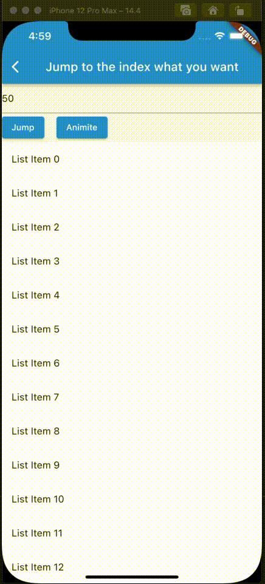
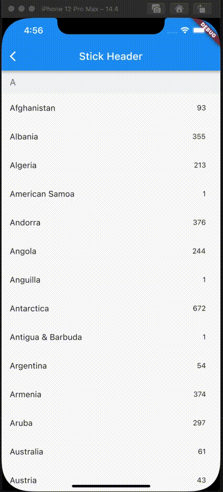
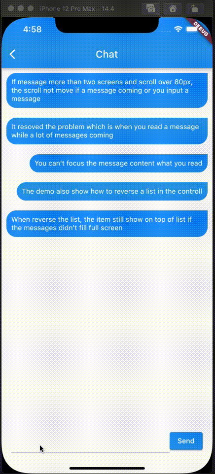
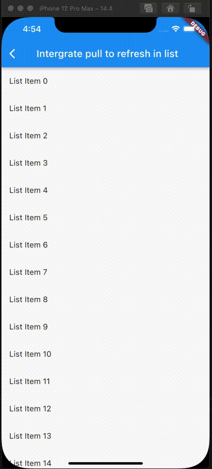

## Flutter List View

Enhance list view to support scroll to index, jump to index, header sticky, enable without scroll when insert data on top and turn performance to reused items.

## Features

1. Support the list view to jump to and scroll to index.
2. Support for inserting data without scrolling  
3. Support for show top in reverse mode if the data can't fill the full viewport.
4. Support sticky header.
5. Support integrated pull_to_refresh
6. When initializing data, allow for scrolling to specify an index.
7. To save performance, flutter list_view always reuses the rendered item.
8. Support to keep specifying items without reusing and disposing of them once the item is created.

## Screen
|  |  |
| :-----:| :----: |
|  |  |
|  |  |

## Example
```dart
FlutterListView(
      delegate: FlutterListViewDelegate(
    (BuildContext context, int index) =>
        ListTile(title: Text('List Item ${data[index]}')),
    childCount: data.length,
  ))
```
### Jump to index
```dart
flutterListViewController.jumpToIndex(100);
```
OR
```dart
/// Declare
FlutterListViewController controller = FlutterListViewController();
...
controller.sliverController
                      .jumpToIndex(100);
...
FlutterListView(
  controller: controller,
  delegate: FlutterListViewDelegate(
    (BuildContext context, int index) => Container(
      color: Colors.white,
      child: ListTile(title: Text('List Item ${data[index]}')),
    ),
    childCount: data.length,
  ))
```

If you want better user expierence, preferItemHeight or onItemHeight may set to.
- preferItemHeight 
The package don't know the item's height, If you don't set, package alway think the item height is 50 util layout the item. If you know the height, you should set it.  
- onItemHeight
like preferItemHeight, the function will used to get height of each item util the item layout.
### Keep Position
```dart
_renderList() {
  return FlutterListView(
      reverse: true,
      delegate: FlutterListViewDelegate(
          (BuildContext context, int index) => Align(
                alignment: Alignment.centerRight,
                child: Padding(
                  padding: const EdgeInsets.all(10.0),
                  child: Container(
                    decoration: const BoxDecoration(
                        color: Colors.blue,
                        borderRadius: BorderRadius.only(
                            topLeft: Radius.circular(20),
                            bottomLeft: Radius.circular(20),
                            bottomRight: Radius.circular(20))),
                    child: Padding(
                      padding: const EdgeInsets.all(10.0),
                      child: Text(
                        chatListContents[index].msg,
                        style: const TextStyle(
                            fontSize: 14.0, color: Colors.white),
                      ),
                    ),
                  ),
                ),
              ),
          childCount: chatListContents.length,
          onItemKey: (index) => chatListContents[index].id.toString(),
          keepPosition: true,
          keepPositionOffset: 80,
          firstItemAlign: FirstItemAlign.end));
}
```

Notice: Keep positoin need implement onItemKey, the onItemKey used to identify the unique of item. The key should difference with other items' key.
We use the key to know what position you insert to current list. if you insert a item before the rendered item, package should increase the scrollOffset.

### Sticky header
```dart
Widget _renderHeader(String text) {
  return Container(
    color: const Color(0xFFF3F4F5),
    child: Padding(
      padding: const EdgeInsets.symmetric(horizontal: 16.0, vertical: 12.0),
      child: Text(
        text,
        style: const TextStyle(fontSize: 18, color: Color(0xFF767676)),
      ),
    ),
  );
}

Widget _renderItem(CountryModel itemData) {
  return Padding(
      padding: const EdgeInsets.only(right: 12.0),
      child: ListTile(
          title: Text(itemData.name), trailing: Text(itemData.phoneCode)));
}

@override
Widget build(BuildContext context) {
  return Scaffold(
    appBar: AppBar(title: const Text("Stick Header")),
    body: FlutterListView(
        delegate: FlutterListViewDelegate(
          (BuildContext context, int index) {
            var data = _countries[index];
            if (data is AlphabetHeader) {
              return _renderHeader(data.alphabet);
            } else {
              return _renderItem(data as CountryModel);
            }
          },
          childCount: _countries.length,
          onItemSticky: (index) => _countries[index] is AlphabetHeader,
        ),
        controller: controller),
  );
}

```
You can also check doc/stickyHeader.md

### Integrate pull_to_refresh
```dart
@override
Widget build(BuildContext context) {
  return Scaffold(
    appBar: AppBar(
      title: const Text("Intergrate pull to refresh in list"),
    ),
    body: SmartRefresher(
      enablePullDown: true,
      enablePullUp: true,
      header: const WaterDropHeader(),
      footer: CustomFooter(
        builder: (context, mode) {
          Widget body;
          if (mode == LoadStatus.idle) {
            body = const Text("pull up load");
          } else if (mode == LoadStatus.loading) {
            body = const CupertinoActivityIndicator();
          } else if (mode == LoadStatus.failed) {
            body = const Text("Load Failed!Click retry!");
          } else if (mode == LoadStatus.canLoading) {
            body = const Text("release to load more");
          } else {
            body = const Text("No more Data");
          }
          return SizedBox(
            height: 55.0,
            child: Center(child: body),
          );
        },
      ),
      controller: _refreshController,
      onRefresh: _onRefresh,
      onLoading: _onLoading,
      child: FlutterListView(
          delegate: FlutterListViewDelegate(
        (BuildContext context, int index) =>
            ListTile(title: Text('List Item ${data[index]}')),
        childCount: data.length,
      )),
    ),
  );
}
```

### Support to keep specifying items without reusing and disposing of them once the item is created.
```dart
FlutterListView(
  delegate: FlutterListViewDelegate(
      (BuildContext context, int index) =>
          Item(text: data[index].toString()),
      childCount: data.length,
      // If onItemKey is not given, the key is index
      // The example is indicate the "40" item will not be reused and disposed after it was created
      onIsPermanent: (key) => key == "40"))
```